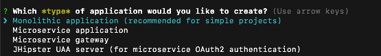

# JHipster - Gerando Código para o Backend e para o FrontEnd

JHipster é uma plataforma de desenvolvimento para gerar, desenvolver e fazer o  deploy de aplicações Web usando `Spring Boot` + `Angular/React`.  Pode-se usá-la também para criar microserviços Spring . 


## Iniciando com o JHipster

1. Crie uma pasta em `Grupo de Estudo/jhipster`. Essa pasta será utilizada para criar a nossa aplicação:

2. Vá para a pasta recém criada :

```java
cd jhipster/
```

3. Gere a sua primeira aplicação, simplesmente digitando:

```java
jhipster
```

4. Diversas questões deverão ser respondidas para criar a nossa aplicação. Vamos a elas então:

<p align="center">
  
</p>


::: :pushpin: Importante :::

> Essa pergunta refere-se ao tipo de aplicação que se deseja criar.
Os tipos de aplicações possíveis são as seguintes:

  . Monolithic application (recommended for simple projects) 
  . Microservice application 
  . Microservice gateway 
  . JHipster UAA server (for microservice OAuth2 authentication) 


Once the application is generated, you can launch it using Maven (./mvnw on Linux/MacOS/Windows PowerShell, mvnw on Windows Cmd) or Gradle (./gradlew on Linux/MacOS/Windows PowerShell, gradlew on Windows Cmd).

The application will be available on http://localhost:8080

Important if you want to have “live reload” of your JavaScript/TypeScript code, you will need run npm start or yarn start. You can go to the Using JHipster in development page for more information.

